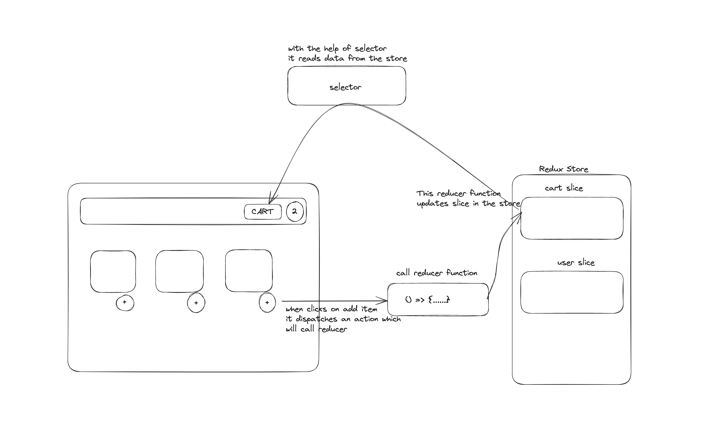

In this episode we learned about 

- how to manage data very efficiently in our application
- Redux library - to manage data layer of application
- previously we used UseContext to avoid prop drilling(Context is the central place where the data is present and any compoenent can read and update data)
- we our application has a large scope, it needs multiple contexts so instead of creating multiple contexts we can use a redux store
- use Context for smaller projects and use redux for larger projects
- there are multiple alternatives for redux eg : ngrx 
- Redux library has some concers (complex configuration, too much boilerplate code , lots of packages, etc)
- hence we used Redux toolkit(it is a package intended to be std way to write Redux logic)
- redux store is a global thing , can be accessed from anywhere in the app
- everything is put in single store 
- store have slices (logical separation for different functionalities - eg user, cart, etc)
- components can not directly modify the store (need to dispath an action to modify the sore)
- action calls a function and the function will modify data
- the function is known as reducer

to write in store - if we click in submit button , it will dispatch an action which will call the reducer function which will update the slice in the store

to read from the store - use selector(selector is the hook)
 

